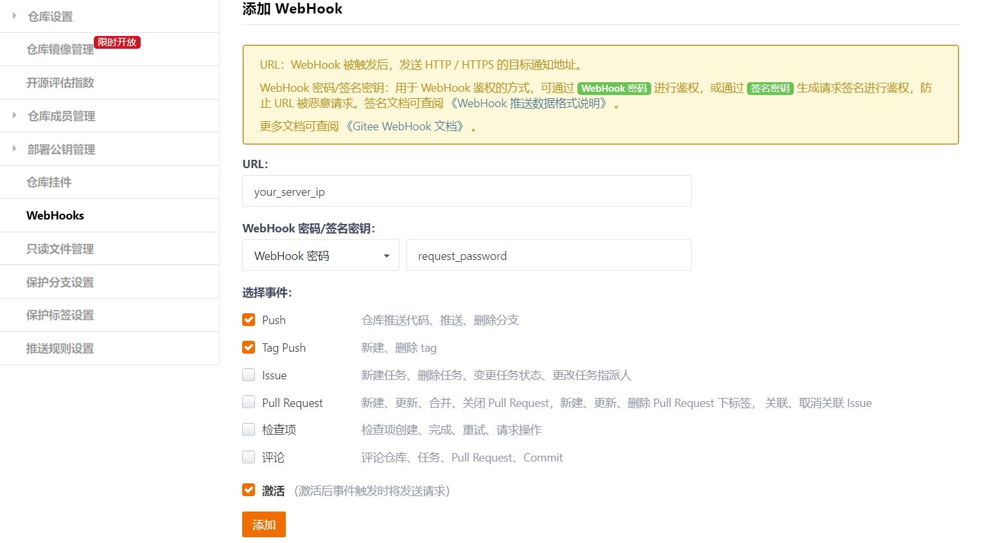

# 中间服务器部署
## 构建webhook server
1. 首先需要安装python环境（建议使用miniconda环境），并安装flask库：`pip install flask`  
2. 使用WSGI服务器进行托管Flask程序，安装Gunicorn：`pip install gunicorn`  
3. 使用 Nginx 作为反向代理服务器：
    - 首先安装Nginx，ubuntu使用 `sudo apt-get install nginx`  
    - 编写Nginx配置文件，到/etc/nginx/sites-available/文件夹下，创建一个新的文件，这里叫做`inula_app.conf`
        ```
        server {
            listen 80;

            server_name your_server_ip;

            location / {
                proxy_pass http://localhost:5000; 
                proxy_set_header Host $host;
                proxy_set_header X-Real-IP $remote_addr;
                proxy_set_header X-Forwarded-For $proxy_add_x_forwarded_for;
                proxy_set_header X-Forwarded-Proto $scheme;
            }
        }
        ```
        上面的server_name为自己服务器的地址，proxy_pass的端口号由自己指定，这里为5000，后面启动的服务也要和这里一致
    - 将该文件链接到/etc/nginx/sites-enabled/文件夹下：`ln -s /etc/nginx/sites-available/inula_app.conf /etc/nginx/sites-enabled/`
    - `sudo nginx -t && sudo systemctl restart nginx` 检查配置并重启服务
4.  修改`gitee-webhook-server\server_app.py`文件中的`request_password`为自己需要的字符串；
    修改`gitee-webhook-server\trigger.sh`脚本中的`repository_name`为需要同步的github仓库名，`github_token`为仓库授权的用户的认证token，可以在https://github.com/settings/tokens 中创建。
5.  到`gitee-webhook-server`文件夹下启动服务：`gunicorn -w 4 -b 0.0.0.0:5000 server_app:app` 这里的5000为和上面步骤3配置中的对应的端口。
6.  在gitee仓库的webhooks中添加需要的WebHook，填写步骤4中设置的密码和服务器的地址，并勾选需要的触发事件，我们的实现中是Push和Tag Push事件。如下图所示
    
7.  至此，就可以对push和push tag操作进行同步了。

## 配置测试覆盖率展示网站
1. 配置 Nginx 作为反向代理服务器：
    - 编写Nginx配置文件，到/etc/nginx/sites-available/文件夹下，创建一个新的文件，这里叫做`coverage.conf`
        ```
        server {
            listen 8088;
            server_name your_server_ip;

            location / {
                root path_to/test-coverage;
                index main.html;
            }

            location /figs/ {
                alias path_to/test-coverage/figs/;
            }

            location /inula-packages/ {
                alias path_to/test-coverage/inula-packages/;
            }
        }
        ```
        上面的listen为自己指定的端口，server_name为自己服务器的地址，`path_to`为`test-coverage`文件夹所在的路径。

    - 将该文件链接到/etc/nginx/sites-enabled/文件夹下：`ln -s /etc/nginx/sites-available/coverage.conf /etc/nginx/sites-enabled/`
    - `sudo nginx -t && sudo systemctl restart nginx` 检查配置并重启服务
2. 需要在自己的服务器中加入ssh公钥，并把ssh私钥、服务器地址、用户和对应的文件目录加入到需要同步的github仓库的secrets中去，才能通过ssh将覆盖率的结果传输到该服务器上面。
3. 然后通过`your_server_ip:8088`就可以访问到main.html，并通过点击访问不同的子页面看到每个子目录的覆盖率。
    
